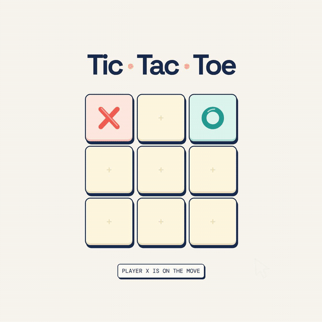

<p align="center">
  
</p>

# TicTacToe — Minimax

A small, playable Tic-Tac-Toe game that makes its decision-making visible.



## Why this exists

This project began with a college memory: the first time I implemented Tic-Tac-Toe with the Minimax algorithm.

At the time, Minimax felt almost like magic. It explores possible futures, assumes the opponent will make the best possible move, then works backward through the decision tree to choose its own move.

Years later, with more experience as a software engineer, I wanted to revisit that feeling and rebuild the idea with TypeScript and React. The goal was not to make just another Tic-Tac-Toe game. It was to make the algorithm visible — to turn an abstract search into something you can watch unfold.

That is why the project also includes a Remotion visualization: one move expands into possible futures, those futures receive their outcomes, and the tree contracts into the move the algorithm chooses.

There is a personal motivation, too. As AI becomes part of everyday development and increasingly complex technology starts to feel ordinary, I wanted to return to the kind of simple algorithm that made programming feel fascinating in the first place.

It is a small project about algorithms, visualization, and, above all, curiosity.

## What it does

- Lets you play as `X` against an unbeatable `O` opponent.
- Uses Minimax to evaluate every legal continuation of a position.
- Memoizes board-and-turn states during a search.
- Shows game state, score, turn feedback, animations, and sound effects in the React app.
- Renders a cinematic explanation of the search tree with Remotion.

The game and the video share the same Minimax implementation, so the visualization represents a real search rather than a mocked-up explanation.

## Built with

- [React](https://react.dev/) and [TypeScript](https://www.typescriptlang.org/)
- [Vite](https://vite.dev/) and [Tailwind CSS](https://tailwindcss.com/)
- [Remotion](https://www.remotion.dev/) for the Minimax visualization
- [Framer Motion](https://www.framer.com/motion/) for UI motion

## Run locally

```bash
bun install --frozen-lockfile
bun run dev
```

Open the local URL printed by Vite.

### Other commands

```bash
# Type-check and create a production build
bun run build

# Open the Remotion editor
bun run video:studio

# Render the Minimax video to out/tictactoe-cinematic.mp4
bun run video:render
```

## Project map

```text
src/
  components/        Game UI and the Remotion composition
  hooks/             Game lifecycle and AI turn handling
  lib/minimax.ts     Shared Minimax search
  remotion/          Composition registration and visual primitives
public/logos/        App logo and favicon
assets/demo.mp4      Project demo
```

## Deployment

The app is configured for GitHub Pages. Pushes to `main` run the deployment workflow in [`.github/workflows/deploy.yml`](./.github/workflows/deploy.yml). In the repository settings, set **Pages → Source** to **GitHub Actions**.

> [!NOTE]
> No environment variables are needed for the standard GitHub Pages URL. The Vite base path is inferred from GitHub Actions; set `VITE_BASE_PATH=/` only when deploying to a custom domain or another root path.
